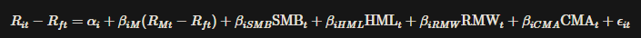

Fama-French Factor Loadings
================

# Purpose

Here is a function and supplementary code I wrote to calculate
Fama-French 5 Factor loadings on multiple funds simultaneously. These
factor loadings are often used within financial modelling, but their
creation (however simple) is not well documented in code. The function
itself is stored [here](code/calcFactorLoadings.R) , while the README
serves as an explanation and usage guide. A Python implementation can
found [here](code/calcFactorLoadings.py).

This is not a guide on calculating the Fama-French factors themselves.
That can be found
[here](https://stablebread.com/how-to-calculate-and-interpret-the-fama-and-french-and-carhart-multifactor-models/).
Be warned, this is a very data intensive process and will likely require
access to a paid data platform, like the Bloomberg terminal.

The libraries used are: `tidyverse`, `zoo`, `readxl` and `kableExtra`.

# Data

In this example I work with US data. The actual Fama-French factors for
the US is freely available
[here](https://mba.tuck.dartmouth.edu/pages/faculty/ken.french/data_library.html).
Two dataframes are required for the calculation that will follow. The
Fama-French factors and the historical returns of funds that you wish to
calculate loadings for. Where you get fund returns is up to you. The
data loading can be seen below.

``` r
# Load data
benchmark_vec <- c("Benchmark 1: S&P 500 TR USD",
                      "Benchmark 2: MSCI EAFE PR USD",
                      "Peer Group: Display Group",
                      "Number of investments ranked",
                      "Median")

main_df <- read.csv("data/main_df.csv") %>%
    select(-1) %>% 
    filter(!Fund %in% benchmark_vec) %>% #Filter out garbage columns
    select(Date, Fund, Returns)

FF_factors <- read_excel("data/FF5.xlsx") %>%
    mutate(Date = as.Date(Date))

kable(head(main_df), caption = "Fund Returns")
```

| Date       | Fund                                     |  Returns |
|:-----------|:-----------------------------------------|---------:|
| 2014-05-31 | 1618 Investment Actions Amérique du Nord |       NA |
| 2014-05-31 | 1741 Equity Systematic US Fund           | 1.995798 |
| 2014-05-31 | AAF-FoM North American Eqs A\$           | 1.766953 |
| 2014-05-31 | AAM Selection US Equities D              |       NA |
| 2014-05-31 | AB Concentrated US Eq S1 USD             | 1.408451 |
| 2014-05-31 | AB Security of the Future WNN USD        |       NA |

Fund Returns

``` r
kable(head(FF_factors), caption = "FF5 factors")
```

| Date       | Mkt-RF |   SMB |   HML |   RMW |   CMA |  RF |
|:-----------|-------:|------:|------:|------:|------:|----:|
| 2014-05-31 |   2.06 | -1.89 | -0.13 |  0.05 | -1.00 |   0 |
| 2014-06-30 |   2.61 |  3.11 | -0.70 | -1.89 | -2.00 |   0 |
| 2014-07-31 |  -2.04 | -4.29 |  0.03 |  0.89 |  0.52 |   0 |
| 2014-08-31 |   4.24 |  0.31 | -0.45 | -0.64 | -0.70 |   0 |
| 2014-09-30 |  -1.97 | -3.72 | -1.34 |  1.30 | -0.51 |   0 |
| 2014-10-31 |   2.52 |  3.73 | -1.81 | -0.57 | -0.11 |   0 |

FF5 factors

As can be seen above, fund returns (`main_df`) should be in long format.
It requires three columns, namely Date, Fund, Returns. It can have
additional columns, since the function will deal with this
automatically. The factors (`FF_factors`), require a Date column in the
same format as the fund_returns, and then a column for each factor in
the analysis. **Note:** The column names are hard-coded into the
function. If you have a different naming convention / different factors,
you will have to alter them in the function itself.

# How are factor loadings calculated

Factor loadings are calculated based on a 36-month rolling regression
given by the equation:



where:

- $R_{it}$ is the return of the portfolio or asset $i$ at time $t$,
- $R_{ft}$ is the risk-free rate at time $t$,
- $R_{Mt}$ is the return of the market portfolio at time $t$,
- $\alpha_i$ is the intercept (alpha) for asset $i$,
- $\beta_{iM}$ is the sensitivity of the asset’s returns to the market
  risk premium (market beta),
- $\beta_{iSMB}$ is the sensitivity of the asset’s returns to the size
  factor (Small Minus Big),
- $\beta_{iHML}$ is the sensitivity of the asset’s returns to the value
  factor (High Minus Low),
- $\beta_{iRMW}$ is the sensitivity of the asset’s returns to the
  profitability factor (Robust Minus Weak),
- $\beta_{iCMA}$ is the sensitivity of the asset’s returns to the
  investment factor (Conservative Minus Aggressive),
- $\epsilon_{it}$ is the error term for asset $i$ at time $t$.

In more practical terms this means the following: Lets say you have
returns data for a particular fund for 100 periods. You then regress the
first 36 periods ($t = 1$ to $t = 36$) of returns onto the first 36
periods of factors. The $\alpha$ and $\beta$’s, as well as their
standard errors, are the factor loadings for $t=36$ and is then stored.
Next, you increment one period, now considering $t = 2$ to $t = 37$, and
the regression is repeated, creating the factor loadings for $t=37$.
This process is repeated until you get the factor loadings up until
$t=100$. You have successfully created factor loadings with standard
errors for **ONE** fund.

This entire process is now repeated for every fund you have data for.
What you are left with is a data frame with the factor loadings for any
given fund, for any given month.

# Running the function

The first step is to apply the `calcFactorLoadings()` function to all
unique funds in the data. Each run of the function produces a dataframe
of factor loadings for a particular fund. All these dataframes are then
stored in a list.

``` r
# Get all the funds in the data
funds <- unique(main_df$Fund)

# Apply calcFactorLoadings to all funds in main dataframe
# Store each in a seperate element in a list
results_list <- lapply(funds, function(name) {
    calcFactorLoadings(main_df, name)
})
```

Next all these dataframes are binded together.

``` r
# Combine all dataframes in the list into one big dataframe
factor_loadings <- do.call(rbind, results_list) %>% 
    select(Date, Fund, c(1:(ncol(.)-2)))

kable(head(factor_loadings))
```

| Date       | Fund                           | X.Intercept. | X.Mkt.RF. |        SMB |       HML |        RMW |        CMA | X.Intercept.\_se | X.Mkt.RF.\_se |    SMB_se |    HML_se |    RMW_se |    CMA_se |
|:-----------|:-------------------------------|-------------:|----------:|-----------:|----------:|-----------:|-----------:|-----------------:|--------------:|----------:|----------:|----------:|----------:|
| 2017-04-30 | AAF-FoM North American Eqs A\$ |   -0.0950180 |  1.044274 | -0.0132219 | 0.0271900 | -0.1385145 | -0.0584346 |        0.0823175 |     0.0272314 | 0.0346326 | 0.0416809 | 0.0636197 | 0.0764708 |
| 2017-05-31 | AAF-FoM North American Eqs A\$ |   -0.0845645 |  1.046420 | -0.0181051 | 0.0296888 | -0.1389186 | -0.0647327 |        0.0815205 |     0.0270342 | 0.0344483 | 0.0412512 | 0.0629376 | 0.0758908 |
| 2017-06-30 | AAF-FoM North American Eqs A\$ |   -0.0642401 |  1.044328 | -0.0144155 | 0.0313622 | -0.1532679 | -0.0698817 |        0.0812795 |     0.0272397 | 0.0352099 | 0.0416995 | 0.0622029 | 0.0781119 |
| 2017-07-31 | AAF-FoM North American Eqs A\$ |   -0.0855267 |  1.045515 | -0.0021212 | 0.0313185 | -0.1452375 | -0.0813340 |        0.0803267 |     0.0266853 | 0.0352885 | 0.0409121 | 0.0605236 | 0.0769163 |
| 2017-08-31 | AAF-FoM North American Eqs A\$ |   -0.0875397 |  1.055657 | -0.0026923 | 0.0264652 | -0.1527069 | -0.0544473 |        0.0802369 |     0.0270592 | 0.0353257 | 0.0408102 | 0.0606348 | 0.0750228 |
| 2017-09-30 | AAF-FoM North American Eqs A\$ |   -0.0739125 |  1.053096 | -0.0088274 | 0.0264182 | -0.1514399 | -0.0541082 |        0.0791615 |     0.0267291 | 0.0348915 | 0.0401774 | 0.0594493 | 0.0732928 |

And there you have it. A dataframe with factor loadings for all funds in
the data. Happy modelling.
